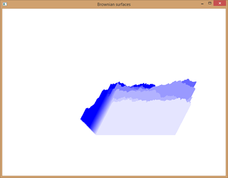
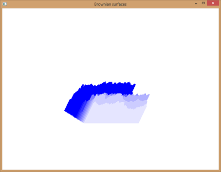

# OpenGL Brownian Surfaces

## Overview
This project visualizes Brownian surfaces using OpenGL. The surfaces are generated based on a mathematical function and rendered with interactive rotation capabilities. 

## Features
- **Dynamic Surface Rendering:** Generates a Brownian surface and displays it using OpenGL.
- **Interactive Rotation:** Allows rotation of the view using mouse inputs.
- **Color Variation:** Applies different colors to surfaces based on height for better visualization.

## Usage
- **Display Surface:** The program will render the Brownian surface automatically when run.
- **Rotate View:** Click and drag with the mouse to rotate the view.

## Results
The following images demonstrate the results of the Brownian surface generation with varying parameters:

1. **One-Dimensional Case with Different Amplitudes:**
   - **Amplitude = 10**  
     

   - **Amplitude = 50**  
     

   - **Amplitude = 100**  
     

2. **Frontal View of the Surface:**
   - The surface color lightens with distance for better visualization.  
     

3. **Surface View with Different Indices:**
   - Demonstrates the surface with various index values.  
     - **View 1**  
       
     - **View 2**  
       

## Code Structure
- **main()**: Initializes OpenGL, sets up the window, and starts the main loop.
- **Init()**: Configures initial OpenGL settings.
- **Draw()**: Renders the Brownian surface.
- **display()**: Handles the display function, including rotation based on user input.
- **resize()**: Adjusts the viewport and projection matrix when the window is resized.
- **mouse()**: Manages mouse input for rotating the view.

## Dependencies
- **OpenGL**: 3D rendering library
- **GLUT**: Utility toolkit for OpenGL
- **GLAUX**: Additional utilities for OpenGL
